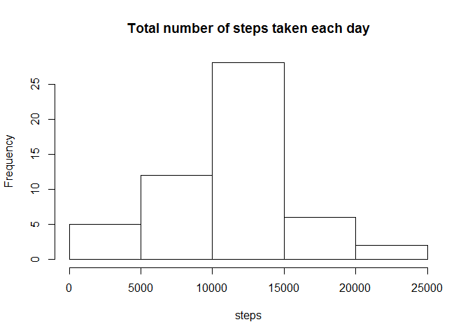

# Assignment 1 Activity Monitoring
Zulkhairi MD  
October 13, 2015  

1.**Loading and preprocessing the data**  
Read the activity dataset and convert date column to date format YYYY-MM-DD

```r
library(ggplot2)
library(knitr)
file <- "activity.csv"
dat <- read.csv(file, header = TRUE, sep = ",")
dat$date <- as.Date(dat$date)
```
2.**: What is mean total number of steps taken per day?**  

```r
#Calculate the total number of steps taken per day
total_num_steps_perday <- aggregate(dat$steps, list(date = dat$date), sum)
colnames(total_num_steps_perday) <- c("date", "steps")#rename columns
head(total_num_steps_perday)#print sample total steps per day
```

```
##         date steps
## 1 2012-10-01    NA
## 2 2012-10-02   126
## 3 2012-10-03 11352
## 4 2012-10-04 12116
## 5 2012-10-05 13294
## 6 2012-10-06 15420
```

```r
#Make a histogram of the total number of steps taken each day
with(total_num_steps_perday, hist(steps, main = "Total number of steps taken each day"))
```

 
  
Calculate and report the mean and median total number of steps taken per day.  

```r
mean_steps_perday <- aggregate(dat$steps, list(date = dat$date), mean)
colnames(mean_steps_perday) <- c("date", "mean_steps")
median_steps_perday <- aggregate(dat$steps, list(date = dat$date), median)
colnames(median_steps_perday) <- c("date", "median_steps")
total_steps_perday <- merge(total_num_steps_perday, mean_steps_perday)#merge mean and median total steps per day
total_steps_perday <- merge(total_steps_perday, median_steps_perday)
mean_steps <- mean(na.omit(dat$steps))
median_steps <- median(na.omit(dat$steps))
```

###The mean and median total number of steps taken per day is as follow:  

```r
total_steps_perday  
```

```
##          date steps mean_steps median_steps
## 1  2012-10-01    NA         NA           NA
## 2  2012-10-02   126  0.4375000            0
## 3  2012-10-03 11352 39.4166667            0
## 4  2012-10-04 12116 42.0694444            0
## 5  2012-10-05 13294 46.1597222            0
## 6  2012-10-06 15420 53.5416667            0
## 7  2012-10-07 11015 38.2465278            0
## 8  2012-10-08    NA         NA           NA
## 9  2012-10-09 12811 44.4826389            0
## 10 2012-10-10  9900 34.3750000            0
## 11 2012-10-11 10304 35.7777778            0
## 12 2012-10-12 17382 60.3541667            0
## 13 2012-10-13 12426 43.1458333            0
## 14 2012-10-14 15098 52.4236111            0
## 15 2012-10-15 10139 35.2048611            0
## 16 2012-10-16 15084 52.3750000            0
## 17 2012-10-17 13452 46.7083333            0
## 18 2012-10-18 10056 34.9166667            0
## 19 2012-10-19 11829 41.0729167            0
## 20 2012-10-20 10395 36.0937500            0
## 21 2012-10-21  8821 30.6284722            0
## 22 2012-10-22 13460 46.7361111            0
## 23 2012-10-23  8918 30.9652778            0
## 24 2012-10-24  8355 29.0104167            0
## 25 2012-10-25  2492  8.6527778            0
## 26 2012-10-26  6778 23.5347222            0
## 27 2012-10-27 10119 35.1354167            0
## 28 2012-10-28 11458 39.7847222            0
## 29 2012-10-29  5018 17.4236111            0
## 30 2012-10-30  9819 34.0937500            0
## 31 2012-10-31 15414 53.5208333            0
## 32 2012-11-01    NA         NA           NA
## 33 2012-11-02 10600 36.8055556            0
## 34 2012-11-03 10571 36.7048611            0
## 35 2012-11-04    NA         NA           NA
## 36 2012-11-05 10439 36.2465278            0
## 37 2012-11-06  8334 28.9375000            0
## 38 2012-11-07 12883 44.7326389            0
## 39 2012-11-08  3219 11.1770833            0
## 40 2012-11-09    NA         NA           NA
## 41 2012-11-10    NA         NA           NA
## 42 2012-11-11 12608 43.7777778            0
## 43 2012-11-12 10765 37.3784722            0
## 44 2012-11-13  7336 25.4722222            0
## 45 2012-11-14    NA         NA           NA
## 46 2012-11-15    41  0.1423611            0
## 47 2012-11-16  5441 18.8923611            0
## 48 2012-11-17 14339 49.7881944            0
## 49 2012-11-18 15110 52.4652778            0
## 50 2012-11-19  8841 30.6979167            0
## 51 2012-11-20  4472 15.5277778            0
## 52 2012-11-21 12787 44.3993056            0
## 53 2012-11-22 20427 70.9270833            0
## 54 2012-11-23 21194 73.5902778            0
## 55 2012-11-24 14478 50.2708333            0
## 56 2012-11-25 11834 41.0902778            0
## 57 2012-11-26 11162 38.7569444            0
## 58 2012-11-27 13646 47.3819444            0
## 59 2012-11-28 10183 35.3576389            0
## 60 2012-11-29  7047 24.4687500            0
## 61 2012-11-30    NA         NA           NA
```
The overall mean steps per day is 37.3825996 and the overall median steps per day is 0  

3. **What is the average daily activity pattern?**  
Make a time series plot (i.e. type = "l") of the 5-minute interval (x-axis) and the average number of steps taken, averaged across all days (y-axis)

```r
ave_steps_perinterval <- aggregate(steps ~ interval, dat, mean)##Calculate average steps per 5-minute interval
ggplot(ave_steps_perinterval, aes(x=interval, y=steps)) +   
  geom_line(color="blue", size=1) +  
  labs(title="Average Daily Activity Pattern", x="5-minute interval", y="Number of steps all days") +  
  theme_bw()
```

 
  
Which 5-minute interval, on average across all the days in the dataset, contains the maximum number of steps?  

```r
#Visual inspection shows that it happens before the 1000 interval mark and after the 550 interval mark
max_interval <- ave_steps_perinterval[which.max(  
  ave_steps_perinterval$steps),]
max_interval
```

```
##     interval    steps
## 104      835 206.1698
```
4. **Imputing missing values**  
Calculate and report the total number of missing values in the dataset (i.e. the total number of rows with NAs)

```r
##sum(is.na(dat$steps))
total_missing_values <- sum(!complete.cases(dat))
```
The total number of missing values in the dataset is 2304.  
  
Devise a strategy for filling in all of the missing values in the dataset. The strategy does not need to be sophisticated. For example, you could use the mean/median for that day, or the mean for that 5-minute interval, etc.

```r
#A strategy is to replace the NA with a substitutute value such as the mean of the interval range

data_full <- dat#Create a new dataset that is equal to the original dataset but with the missing data filled in.
nas <- is.na(data_full$steps)#number of NAs in new dataset
avg_interval <- tapply(data_full$steps, data_full$interval, mean, na.rm=TRUE, simplify=TRUE)#returns mean of steps by 5-min interval while ignoring Nas as a vector
data_full$steps[nas] <- avg_interval[as.character(data_full$interval[nas])]#fill in missing values of steps according to interval-slice
verify <- sum(is.na(data_full$steps))#check for no of Nas in new dataset
```
Verify the number of NAs in the new dataset is 0.  
  
Make a histogram of the total number of steps taken each day and Calculate and report the mean and median total number of steps taken per day.
Plot a histogram of the new dataset

```r
ggplot(data_full, aes(x=steps))+ geom_histogram()
```

```
## stat_bin: binwidth defaulted to range/30. Use 'binwidth = x' to adjust this.
```

 

```r
mean_total_steps <- mean(data_full$steps)
median_total_steps <- median(data_full$steps)
```
The mean total number of steps taken per day is 37.3825996.  
The median total number of steps taken per day is 0.  
  
Do these values differ from the estimates from the first part of the assignment? What is the impact of imputing missing data on the estimates of the total daily number of steps?  
  
**Since the values did not differ, imputing missing data on the total daily number of steps has no effect.**  
  
5. **Are there differences in activity patterns between weekdays and weekends?**  

```r
data_full$weektype <- factor(weekdays(data_full$date))#copy a new factor column from the date taking the weekdays
levels(data_full$weektype) <- list(
  Weekday= c("Monday", "Tuesday","Wednesday","Thursday","Friday"),
  Weekend = c("Saturday", "Sunday")#rename weektype to either weekday or weekend
)
```
Make a panel plot containing a time series plot (i.e. type = "l") of the 5-minute interval (x-axis) and the average number of steps taken, averaged across all weekday days or weekend days (y-axis). See the README file in the GitHub repository to see an example of what this plot should look like using simulated data.  

```r
library("lattice")
weekTypeIntervalSteps <- aggregate(data=data_full, steps ~ weektype + interval, FUN=mean)#create new object to show average of steps across intervals, grouped by weektype

xyplot(
  type="l",
  data=weekTypeIntervalSteps,
  steps ~ interval | weektype,
  xlab="5-minute interval",
  ylab="Number of steps",
  layout=c(1,2)
)
```

 
  
**Visual inspection of the two graphs shows overall increased in number of steps during weekends**  
